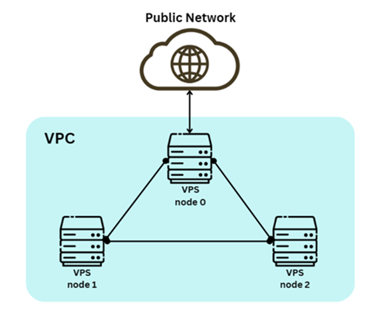
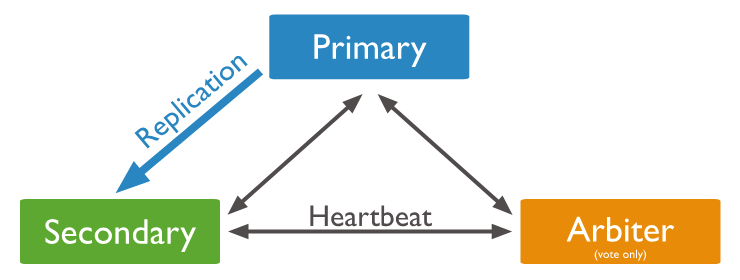

## cluster Infrastructure

We employed 3 Virtual Private Servers (VPSs) and used a Virtual Private Could (VPC) to harden the cluster’s public interface while allowing permissive access to the internal environment.

<style>
    .center_table
    {
        width: auto;
        display: table;
        margin-left: auto;
        margin-right: auto;
    }
</style>

<p align="center"><font size=4.><b>Server Specifications</b></font></p>

<div class="center_table">

|           |      node 0      |      node 1      |  node 2   |
| :-------: | :--------------: | :--------------: | :-------: |
|   type    | high-performance | high-performance | standard  |
|   CPUs    |     2 vCPUs      |     2 vCPUs      |  1 vCPU   |
|    RAM    |     4096 MB      |     4096 MB      |  2048 MB  |
|  storage  |    80 GB SSD     |    80 GB SSD     | 55 GB SSD |
| Bandwidth |       3TB        |       3TB        |    2TB    |

</div>

<div align="center">



</div>

## fail2ban & Nginx

As the cluster is running in a public network environment, server ports are often subject to malicious attacks. To address this problem, `fail2ban` is utilised to detect failed attempts and disable the IP addresses. [jail.local](./jail.local) in `fail2ban` is set to permanently block IPs with three failed requests. `Nginx` is configured by [ngnix.conf](./nginx.conf) to proxy the port and require login authorisation.

## ZooKeeper

`ZooKeeper` is configured by [zoo.cfg](./zoo.cfg) to register and maintain configurations and track node status, thereby electing a new leader node when the primary node fell.

## Kafka

`Kafka` servers are set via [server.properties](./server.properties) relying on `ZooKeeper` to detect the addition and the removal of brokers and consumers, and keep track of the consumed offset of each partition. A `Kafka` topic has been successfully created, allowing for the reception of data from the RSS feed parser running as a Python process in background (see [rss_medium_feed_parser.py](../rss_medium_feed_parser.py)).

Controls provided:

- Medium Story Tag
- Kafka Topic Name (producing to)
- RSS Feed Parsing Time Interval

## Spark Streaming

We used [Spark Standalone Mode](https://spark.apache.org/docs/latest/spark-standalone.html) to deploy a distributed computing system for streaming data processing (detailed settings are in [spark-ha](./spark-ha/)). A `Spark Streaming` application acts as a `Kafka` consumer, processing data from the `Kafka` topic. The application has been developed to scrape Medium story web links, extract article HTML content, and perform article summarization using `OpenAI API` (see [rss_feed_medium_feed_consumer.py](../rss_medium_feed_consumer.py)).

Controls provided:

- Kafka Topic Name (consuming from)

## MongoDB

The `Spark Streaming` application finally sends the generated summaries and article metadata to be stored in the `MongoDB` collection (see [rss_feed_medium_feed_consumer.py](../rss_medium_feed_consumer.py)). To realise the capabilities of data redundancy and availability, read-write separation, and automatic failover, a [replica set](https://www.mongodb.com/docs/manual/replication/) is configured by [mongod.conf](./mongod.conf) (the replica set is named as `rs`).

Commands in `mongo` Shell in this case:

- To initiate the replica set:

```
rs.initiate()
```

- To add `node 1` as Secondary:

```
rs.add(node1)
```

- To add `node 2` as Arbiter:

```
rs.addArb(node2)
```

<p align="center"><font size=4.><b>Roles in the replica set</b></font></p>

<div class="center_table">

| Nodes  |   Roles   |
| :----: | :-------: |
| node 0 |  Primary  |
| node 1 | Secondary |
| node 2 |  Arbiter  |

</div>

<div align="center">



</div>

## Streamlit

The Streamlit Web App is running on [this website](http://70.34.195.228:8501/).
The app pulls data from MongoDB and presents it as a feed with “Tag” filter. Tags are predefined, 4 of them in total available.


